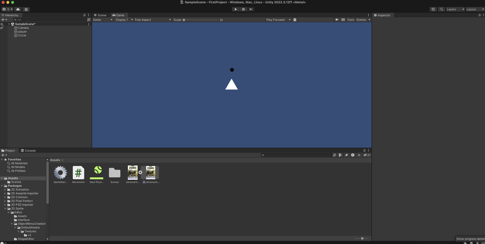
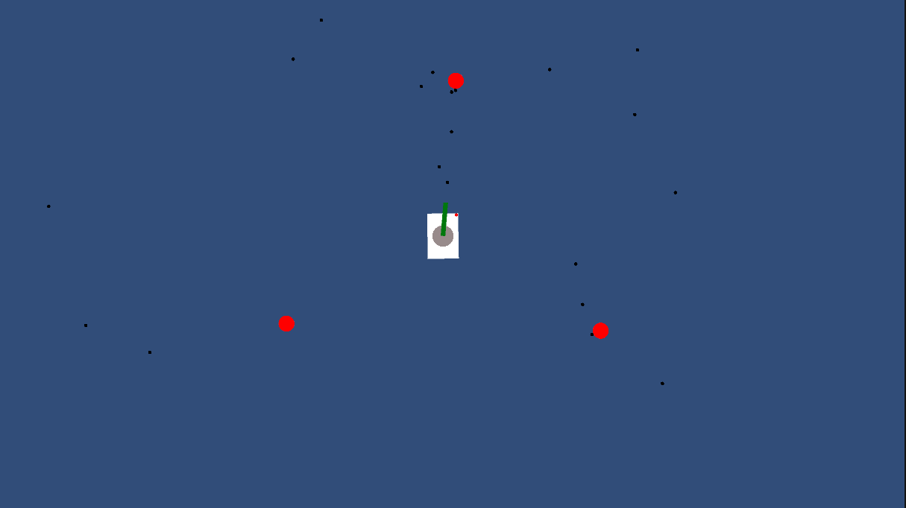

# Devlog

### 10 de noviembre de 2023

> - Conceptos básicos de unity
>    - GameObjects y componentes
> - Triggers, físicas y colisiones
>
> 

`Movement.cs`
```cs
public class Movement : MonoBehaviour
{
    // Start is called before the first frame update
    Rigidbody2D rb2d;
    public float velocity;

    void Start()
    {
        rb2d = GetComponent<Rigidbody2D>();
    }

    // Update is called once per frame
    void Update()
    {
        float verticalMovement = Input.GetAxisRaw("Vertical");
        float horizontalMovement = Input.GetAxisRaw("Horizontal");
        Vector3 movementDir = new Vector3(horizontalMovement, verticalMovement, 0) * Time.deltaTime * velocity;
        Debug.Log(rb2d.velocity.magnitude);
        rb2d.velocity = new Vector2(movementDir.x, movementDir.y)*velocity;
    }

    private void OnCollisionEnter2D(Collision2D collision)
    {
        collision.collider.GetComponent<Rigidbody2D>().AddForce(Vector2.down * 70);
    }
}
```

### 13 de noviembre de 2023

> - Sistema de salud y barra de vida
> - Coneceptos: colisiones y disparadores (`Triggers`)
> - Movimiento de enemigos
> 
> 




### 17 de noviembre de 2023

- **`Update`**:
    - Called every frame
    - Input handling here
    - `Time.deltaTime`: The time it takes to execute one frame (variable)
- **`FixedUpdate`** 
    - Called every fixed interval (0.02s) ("physics framerate")
    - Physics calculations here
    - `Time.fixedDeltaTime`: Physics interval (0.02s by default)

**Health System**
- [ ] Healthbar de jugador
- [x] Invulnerabilidad temporal de jugador al recibir daño
- [x] Condición de pérdida, Game Over

https://www.youtube.com/watch?v=QN8dm0RD3mY&list=PLgXA5L5ma2Bveih0btJV58REE2mzfQLOQ&index=2

**Otros**
- [ ] Menu (otra escena)
- [ ] Enemy spawn
- [ ] Front cannon