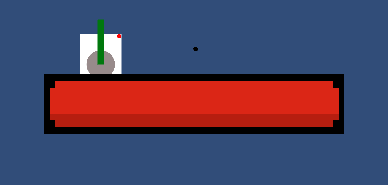

# Devlog

### 10 de noviembre de 2023

> - Conceptos básicos de unity
>    - GameObjects y componentes
> - Triggers, físicas y colisiones
>
> 

`Movement.cs`
```cs
public class Movement : MonoBehaviour
{
    // Start is called before the first frame update
    Rigidbody2D rb2d;
    public float velocity;

    void Start()
    {
        rb2d = GetComponent<Rigidbody2D>();
    }

    // Update is called once per frame
    void Update()
    {
        float verticalMovement = Input.GetAxisRaw("Vertical");
        float horizontalMovement = Input.GetAxisRaw("Horizontal");
        Vector3 movementDir = new Vector3(horizontalMovement, verticalMovement, 0) * Time.deltaTime * velocity;
        Debug.Log(rb2d.velocity.magnitude);
        rb2d.velocity = new Vector2(movementDir.x, movementDir.y)*velocity;
    }

    private void OnCollisionEnter2D(Collision2D collision)
    {
        collision.collider.GetComponent<Rigidbody2D>().AddForce(Vector2.down * 70);
    }
}
```

### 13 de noviembre de 2023

> - Sistema de salud y barra de vida
> - Coneceptos: colisiones y disparadores (`Triggers`)
> - Movimiento de enemigos
> 
> 


### 17 de noviembre de 2023

- **`Update`**:
    - Called every frame
    - Input handling here
    - `Time.deltaTime`: The time it takes to execute one frame (variable)
- **`FixedUpdate`** 
    - Called every fixed interval (0.02s) ("physics framerate")
    - Physics calculations here
    - `Time.fixedDeltaTime`: Physics interval (0.02s by default)

**Health System**
- [x] Healthbar de jugador
- [x] Invulnerabilidad temporal de jugador al recibir daño
- [x] Condición de pérdida, Game Over


**Otros**
- [x] Organizar `PlayerStats`
- [x] Mejorar Daño de enemigos a jugador

### 20 de noviembre de 2023

> Bug <br>
> [Solution](https://forum.unity.com/threads/ontriggerstay-not-being-called.794235/)<br>
> 

- [x] Menu (otra escena)
    - Salir
    - Jugar
- [x] Enemy spawn

Esta semana podemos decirle adiós a los primitives y empezar a añadir **sprites**.

### 24 de noviembre

- [x] Sprite de jugador
- [x] Seguimiento de camara
- [x] Menú Seleccionar tanque
    - tanque
    - \<- anterior
    - -\> Siguiente

### Semana 27 de noviembre - 3 de noviembre

>
> 
> 
> *Tanque disparando a enemigos*

- [ ] **SPRITES** o gráficos, adiós triángulos
- [ ] **UI**
    - [x] Selección de tanque
    - [ ] Pausa
    - [x] Ganar/Perder 
    - [ ] Temporizador


- [ ] **MAPA** Generado aleatoriamente si es posible
- [ ] Front cannon
    - [x] Cañón
    - [ ] Balas diferentes
- [ ] Spawn enemies out of bounds
- [ ] Selección de tanque afecta a juego


### Semana 4 de diciembre - 10 de diciembre

#### Gameplay

- [ ] Progreso
- [ ] boss
- [ ] Drops
- [ ] Niveles

#### Sonidos y efectos

- [ ] Sonidos
    - [ ] Disparo
    - [ ] Impacto
    - [ ] Muerte
        - [ ] Enemigo
        - [ ] Jugador
- [ ] Música

Para los sonidos podemos utilizar [Esta página](https://sfxr.me/)

Para la música alguna música de juego sin copyright
