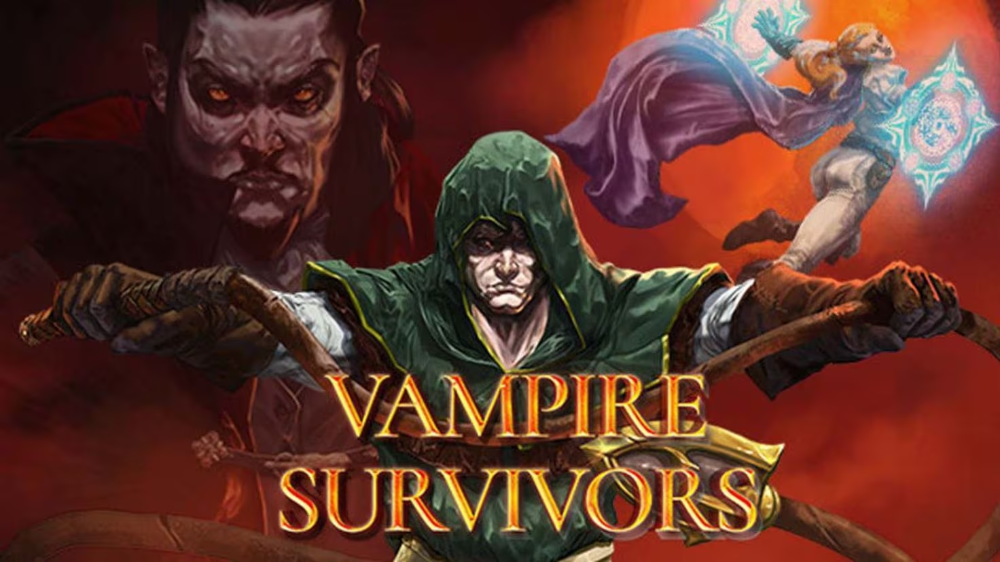

# TONK 

## Turbo Omega Nitro Knight


---

### Índice
 
1. Introducción
2. Descripción del juego
    - Objetivo (sobrevivir)
    - Mecánicas
3. Desarrollo
    - Movimiento de jugador y autoapuntado
    - Movimiento de enemigos
    - Aparición de enemigos
    - Selección de tanque

---

### 1. Introducción

- Experiencia previa con las herramientas (c#, git y unity)
- Elección del tipo de juego
    - Posibilidades (**plataformas**, **naves**, **rpg**, **mecanografía**)
    - Elección final (**survivor**)
- Inspiraciones

---

### 1. Introducción

- Recursos utilizados
    - Proyectos previos
    - [Tutorial para desarrollar un clon de **Vampire Survivors**](https://www.youtube.com/playlist?list=PLgXA5L5ma2Bveih0btJV58REE2mzfQLOQ)
    - [Página para generar efectos de sonido](https://sfxr.me/)
    - [Tutorial para AudioManager, de CodeMonkey](https://www.youtube.com/watch?v=QL29aTa7J5Q)
    - Canales de youtube: Codemonkey y Brackeys
    - Documentación de unity

---

### 2. Descripción del juego

#### Objetivo

- El objetivo del juego es **sobrevivir** un tiempo determinado 
    (5 minutos) a oleadas de enemigos 
- Conforme el juego avanza, aparecen más enemigos
- Es un juego tipo **survivor**

---
**Juegos del género survivors**

- Vampire Survivors
- 20 Minutes Till Dawn
- Brotato
- Yet Another Zombie Survivor   

 

---

#### Mecánicas

1. **Movimiento** del jugador. 
    - 8 direcciones
    - Velocidad estable
2. **Combate**
    - Puntos de vida
    - Enemigos infligen **daño de contacto**
    - Torreta principal con **autoapuntado** (dispara al enemigo más cercano)
    - Torreta secundaria dispara en la **dirección del movimiento**

---
#### Mecánicas

3. **Enemigos**
    - Aparecen alrededor del jugador
    - Reaparecen cada dos segundos hasta alcanzar el número máximo
    - Los enemigos avanzan en linea recta hacia el jugador
4. **Temporizador**
    - El juego finaliza cuando el temporizador llega a 0
5. **Customización**
    - Selección del color del tanque

---

### 3. Desarrollo

Aspectos técnicos del juego (fragmentos de código y explicacion de algunos elementos)


- **Movimiento de jugador**
- **Autoapuntado**
- **Movimiento y aparición de enemigos**
- **Selección de color del tanque**

---

#### Movimiento

**Normalización del vector**
- Problema de velocidad diagonal, solución al normalizar el vector
- ¿Qué es normalizar un vector? (misma dirección y sentido pero **módulo = 1**)

---

**Update y FixedUpdate**
- `FixedUpdate()` es llamado en un **intervalo fijo**, `Update()` se llama **cada frame**.
- `FixedUpdate()` **físicas**
- `Update()` **controles**

```cs
private void Update() {
    movementDir = new Vector2(Input.GetAxisRaw("Horizontal"), Input.GetAxisRaw("Vertical")).normalized;

    IsMoving = movementDir.magnitude != 0;
    if (IsMoving) {
        RotatePlayerSprite(); // Rotación del sprite del jugador en la dirección del movimiento
    }
}
private void FixedUpdate() {

    Vector2 movement = movementDir * MovementSpeed;
    rb2d.velocity = movement;
}
```


---

#### Autoapuntado (`TrackingCannon.cs`)

**Update** (se ejecuta cada frame)
```cs
private void Update() {
    Transform target = FindNearestEnemy();

    if (target != null) {
        LookAtEnemy(transform, target.position, 10f);
    }
}
```
---

#### Autoapuntado (`TrackingCannon.cs`)


---

#### Autoapuntado (`TrackingCannon.cs`)

**1. Encontrar al enemigo más cercano**
```cs
private Transform FindNearestEnemy() {
    Vector2 bottomLeft = Camera.main.ViewportToWorldPoint(new Vector3(0, 0)); // esquina inferior izquierda
    Vector2 topRight = Camera.main.ViewportToWorldPoint(new Vector3(1, 1));   // esquina superior derecha
    Collider2D[] colliders = Physics2D.OverlapAreaAll(bottomLeft, topRight);  // Colliders en el área que forman

    Transform nearestEnemy = null;
    float bestDistance = Mathf.Infinity;

    // En este bucle encontramos el enemigo más cercano al jugador
    foreach (Collider2D collider in colliders) {  
        if (collider.CompareTag("Enemy")) {
            float distance = Vector3.Distance(transform.parent.position, collider.transform.position);
            if (distance < bestDistance) {
                bestDistance = distance;
                nearestEnemy = collider.transform;
            }
        }
    }

    return nearestEnemy;
}
```

---

#### Autoapuntado (`TrackingCannon.cs`)

**2. Mirar hacia el enemigo más cercano**

Un `Quaternion` representa la rotación de un objeto, es un concepto complicado y no es necesario profundizar desarrollando en 2D

```cs
private void LookAtEnemy(Transform enemyTransform, float rotationSpeed) {
    // Dirección a la que tiene que mirar el cañón
    Vector2 lookDirection = enemyTransform.position - transform.position;

    // Ángulo que debe girar el cañón
    float angle = Mathf.Atan2(lookDirection.y, lookDirection.x) * Mathf.Rad2Deg - 90; 
    // Rotación que debe tener el cañón
    Quaternion targetRotation = Quaternion.AngleAxis(angle, Vector3.forward); 
    // Girar suavemente para estar mirando al enemigo
    transform.rotation = Quaternion.Slerp(transform.rotation, targetRotation, rotationSpeed * Time.deltaTime);
}
```
---

#### Movimiento del enemigo


---

#### Movimiento del enemigo

Los enemigos se mueven hacia el jugador.

```cs
private void FixedUpdate() {
    // transform del jugador (Gamemanager tiene una referencia al jugador)
    Transform playerTransform = GameManager.Instance.PlayerTransform; 

    // Vector normalizado que apunta al jugador
    Vector2 dir = (playerTransform.position - transform.position).normalized; 
    Vector2 movement = dir * movementSpeed; 

    // Si el enemigo está en contacto con el jugador, el enemigo no se mueve.
    if (touchingPlayer) {
        rb.velocity = Vector2.zero;
    } else {
        rb.velocity = movement;
    }
}
```
---
#### Spawn de enemigos


---

#### Spawn de enemigos

Genera un enemigo cada `spawnRate` segundos en una de las posiciones de aparición alrededor del jugador

```cs
IEnumerator SpawnRepeating() {
    yield return new WaitForSeconds(spawnRate);
    generateSpawnPoints();
    while(true) {
        if (ActiveEnemies < maxEnemies) {
            // TODO Set enemies' spawning area
            GameObject newEnemy = Instantiate(GetRandomEnemy(), GetSpawnPosition(), Quaternion.identity);
            ActiveEnemies++;
            // EnemyHealthSystem resta uno a activeEnemies cuando el enemigo muere.
            newEnemy.GetComponent<BaseEnemyHealthSystem>().Spawner = this;
        }
        yield return new WaitForSeconds(spawnRate);
    }
}
```

---

#### Spawn de enemigos

**Generación de puntos de aparición de enemigos**

```cs
private void generateSpawnPoints() {
    spawnPoints = new Transform[8];
    int i = 0;

    for (float x = 0; x <= 1; x += .5f) {
        for (float y = 0; y <= 1; y += .5f) {
            if (y == .5f && x == .5f) // Evita crear un punto de aparición en el centro 
                continue;

            Vector3 viewportPosition = new Vector3(x, y, 0);
            Vector3 worldPosition = Camera.main.ViewportToWorldPoint(viewportPosition) + offset;
            worldPosition.z = 0; // En 2D ignoramos el componente z
            spawnPoints[i] = new GameObject("Spawn point " + i).transform;
            spawnPoints[i].position = worldPosition;

            spawnPoints[i].SetParent(GameManager.Instance.PlayerTransform);
            i++;
        }
    }
}
```

---

#### Selección de tanque

- El jugador puede seleccionar varios colores para el tanque.
- Modificar imagen (UI)
- Persistencia de datos entre escenas


---

#### Selección de tanque

```cs
public void NextSprite() {
    // index = ++index == tonkSkins.Count ? 0 : index;
    index++;
    if (index >= tonkSkins.Count) {
        index = 0;
    }
    UpdateSprites();
}
public void PrevSprite() {
    // index = --index < 0 ? tonkSkins.Count - 1 : index;
    index--;
    if (index < 0) {
        index = tonkSkins.Count - 1;
    }
    UpdateSprites();
}
``` 

---

#### Selección de tanque

```cs
private void UpdateSprites() {
    // Imagen en el menú
    tankImage.sprite = tonkSkins[index].tankSprite;
    turretImage.sprite = tonkSkins[index].turretSprite;
    
    // Color del jugador (selectedTankColor es static)
    PlayerAnimation.selectedTankColor = tonkSkins[index].color;
}
```

---

### Preguntas y sugerencias


---

### ¡Gracias por vuestra atención!

&nbsp;&nbsp;&nbsp;&nbsp;&nbsp;&nbsp;&nbsp;&nbsp;&nbsp;